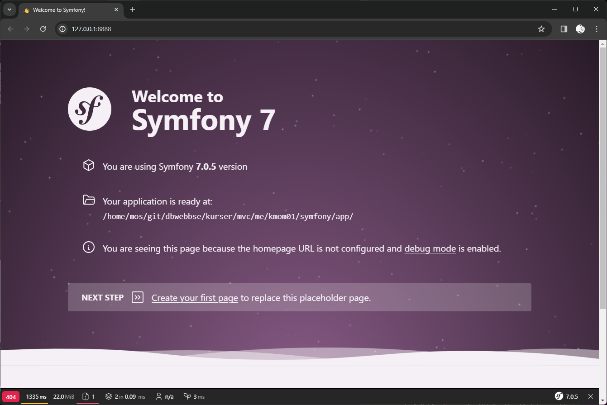

## INTRO TO MVC-COURSE

[](https://scrutinizer-ci.com/g/Veddan12/mvc/?branch=main)

[](https://scrutinizer-ci.com/g/Veddan12/mvc/?branch=main)

[](https://scrutinizer-ci.com/g/Veddan12/mvc/build-status/main)

[](https://scrutinizer-ci.com/code-intelligence)

This repository is for course Objektorienterade webbteknologier at Blekinge Tekniska Högskolan. 
Follow the steps down below to see how to get started with necessary installments needed to clone the repo and begin with web application.

## CLONE REPO

To get started make sure you have PHP 8.3 or higher installed and the latest version of Composer.

### Clone the repository

- Stand in the directory where you want to download the repository.
- Use the following command:
```bash
    git clone https://github.com/Veddan12/mvc/
```

### Enter the directory
    cd mvc

### Install dependencies
```bash
    composer install
    npm install
    npm run build
```
To run the app stand in the project's root folder and run
```bash
    symfony server:start
```

You should now be able to visit the site at:
```bash
    http://127.0.0.1:8000
```

Alternatively, start PHP’s built-in server:

```bash
php -S localhost:8888 -t public
```



### Repo Structure
- `src/` – Application source code (controllers, services, game logic)
- `templates/` – Twig templates for views
- `tests/` – PHPUnit test files
- `public/` – Web root for the Symfony server

This project was developed as part of the final assignment MVC course.
All rights reserved.
Created by Veddan12
